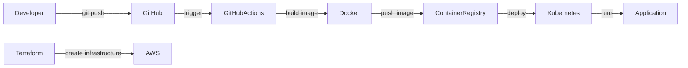

# Production CI/CD Pipeline

A production-style CI/CD pipeline project using GitHub Actions and Docker.

## Overview
This project demonstrates how code can be automatically built, tested, containerized, and prepared for deployment using a modern CI/CD workflow.

## Tech Stack
- GitHub Actions
- Docker
- Linux
- YAML

## Pipeline Stages
1. Source code checkout
2. Build
3. Test
4. Docker image build
5. Deployment preparation

## Goals
- Automate software delivery
- Reduce manual deployment work
- Demonstrate DevOps pipeline skills

## Future Improvements
- Add Kubernetes deployment
- Add Terraform infrastructure
- Add monitoring integration
## Architecture


## DevOps Workflow

1. Developer pushes code to GitHub repository.
2. GitHub Actions triggers the CI/CD pipeline.
3. Application is built and containerized using Docker.
4. Docker image is pushed to the container registry.
5. Terraform provisions infrastructure on AWS.
6. Kubernetes deploys the application.
7. Monitoring tools observe the application performance.
## Pipeline Status

This project uses GitHub Actions to automatically build and push a Docker image to Docker Hub on every push to the main branch.

## Kubernetes Deployment

This project is deployed locally on Kubernetes using Docker Desktop.

### Deployment
```bash
kubectl apply -f kubernetes/deployment.yaml
kubectl apply -f kubernetes/service.yaml
http://localhost:31920
```
